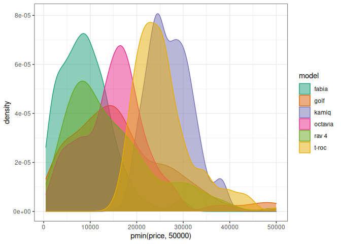
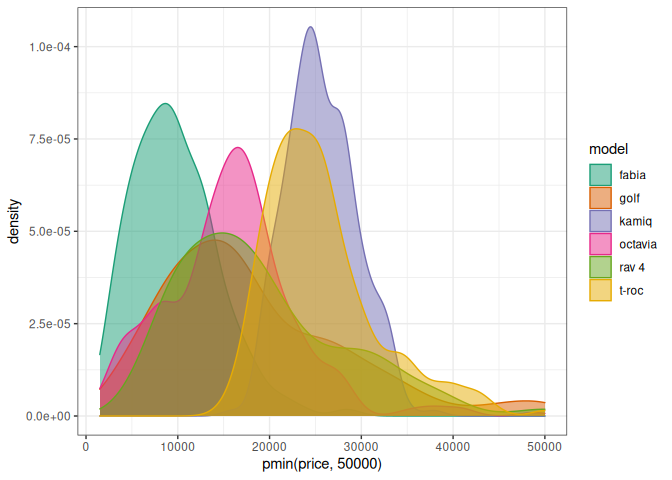
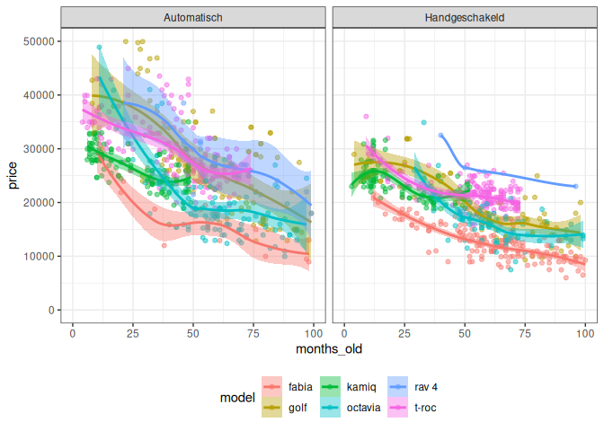
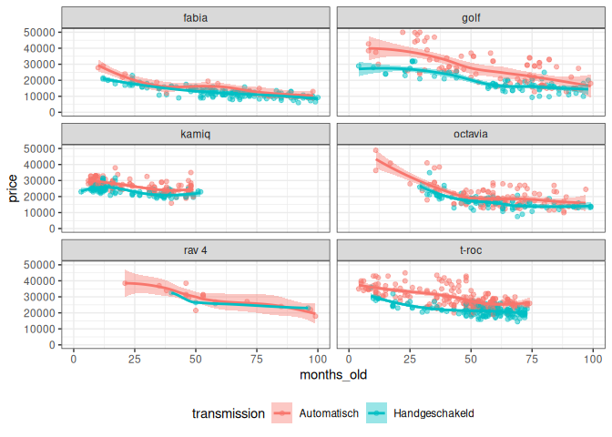
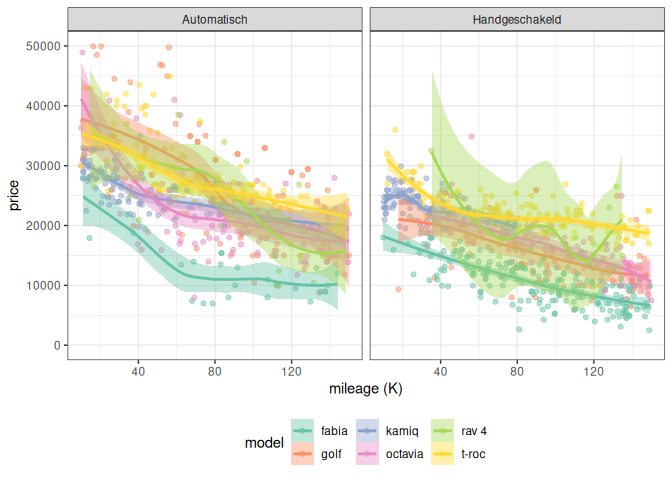
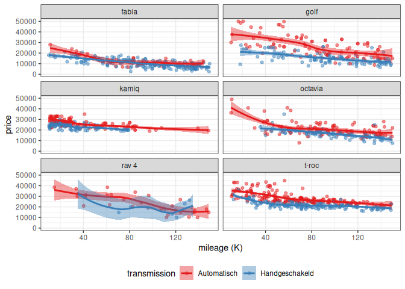
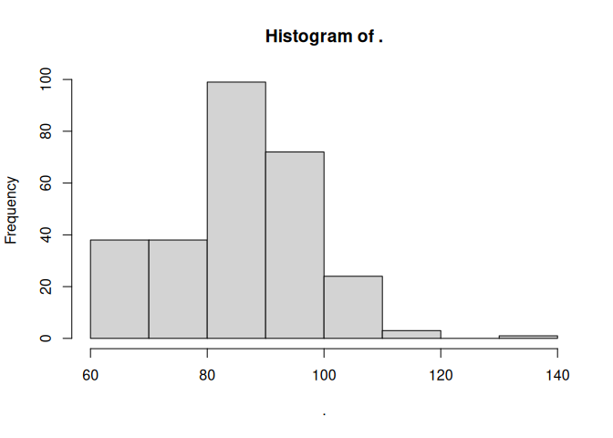

# Used car prices

``` r
library(ggplot2)
library(data.table)
library(RColorBrewer)
library(splines)
library(magrittr)
```

## Data cleaning

``` r
dd = fread("data/extracted2024-02-26.csv")

dd[, .N, keyby=.(fuel_type, transmission)]
```

        fuel_type       transmission    N
     1:         2      - Transmissie    2
     2:         2        Automatisch  281
     3:         2 Half/Semi-automaat    2
     4:         b      - Transmissie    8
     5:         b        Automatisch  729
     6:         b Half/Semi-automaat   11
     7:         b     Handgeschakeld 1062
     8:         c     Handgeschakeld    1
     9:         d      - Transmissie    1
    10:         d        Automatisch   30
    11:         d     Handgeschakeld   87
    12:         e        Automatisch    6
    13:         l        Automatisch    1
    14:         l     Handgeschakeld    1

``` r
# drop non-benzine cars
dd = dd[fuel_type == "b"]

# drop unusual transmissions
dd = dd[transmission %in% c("Automatisch", "Handgeschakeld")]

# final check
dd[, .N, keyby=.(country, fuel_type, transmission)]
```

       country fuel_type   transmission    N
    1:      nl         b    Automatisch  729
    2:      nl         b Handgeschakeld 1062

``` r
ggplot(dd, aes(pmin(price, 50000), color=model, fill=model)) +
  geom_density(alpha=0.5) +
  scale_color_brewer(type='qual', palette=2) +
  scale_fill_brewer(type='qual', palette=2) +
  theme_bw()
```



``` r
dd[, mileage := as.integer(mileage)]
```

    Warning in eval(jsub, SDenv, parent.frame()): NAs introduced by coercion

``` r
dd[, reg_year := as.integer(sapply(strsplit(registration, "-", fixed=T), function(x) x[[2]]))]
dd[, reg_month := as.integer(sapply(strsplit(registration, "-", fixed=T), function(x) x[[1]]))]
dd[, months_old := 12*2024 + 1 - 12*reg_year - reg_month]

# remove new cars
dd = dd[months_old >= 3]

# remove antiques
dd = dd[months_old < 200]

# check distribution again
ggplot(dd, aes(pmin(price, 50000), color=model, fill=model)) +
  geom_density(alpha=0.5) +
  scale_color_brewer(type='qual', palette=2) +
  scale_fill_brewer(type='qual', palette=2) +
  theme_bw()
```



``` r
dd[, hp := as.integer(regmatches(power, regexpr("[0-9-]{1,3}(?= PK)", power, perl=T)))]
```

    Warning in eval(jsub, SDenv, parent.frame()): NAs introduced by coercion

## Plots

### Age vs. Price

``` r
ggplot(dd, aes(months_old, price, color=model, fill=model)) +
  geom_point(alpha=0.5) +
  geom_smooth() +
  facet_wrap(~ transmission, ncol=2) +
  scale_y_continuous(limits=c(0, 50000)) +
  scale_x_continuous(limits=c(0, 100)) +
  theme_bw() +
  theme(legend.position="bottom")
```

    `geom_smooth()` using method = 'loess' and formula 'y ~ x'

    Warning: Removed 407 rows containing non-finite values (stat_smooth).

    Warning in simpleLoess(y, x, w, span, degree = degree, parametric =
    parametric, : span too small. fewer data values than degrees of freedom.

    Warning in simpleLoess(y, x, w, span, degree = degree, parametric =
    parametric, : pseudoinverse used at 39.72

    Warning in simpleLoess(y, x, w, span, degree = degree, parametric =
    parametric, : neighborhood radius 18.28

    Warning in simpleLoess(y, x, w, span, degree = degree, parametric =
    parametric, : reciprocal condition number 0

    Warning in simpleLoess(y, x, w, span, degree = degree, parametric =
    parametric, : There are other near singularities as well. 2141.8

    Warning in predLoess(object$y, object$x, newx = if
    (is.null(newdata)) object$x else if (is.data.frame(newdata))
    as.matrix(model.frame(delete.response(terms(object)), : span too small. fewer
    data values than degrees of freedom.

    Warning in predLoess(object$y, object$x, newx = if
    (is.null(newdata)) object$x else if (is.data.frame(newdata))
    as.matrix(model.frame(delete.response(terms(object)), : pseudoinverse used at
    39.72

    Warning in predLoess(object$y, object$x, newx = if
    (is.null(newdata)) object$x else if (is.data.frame(newdata))
    as.matrix(model.frame(delete.response(terms(object)), : neighborhood radius
    18.28

    Warning in predLoess(object$y, object$x, newx = if
    (is.null(newdata)) object$x else if (is.data.frame(newdata))
    as.matrix(model.frame(delete.response(terms(object)), : reciprocal condition
    number 0

    Warning in predLoess(object$y, object$x, newx = if
    (is.null(newdata)) object$x else if (is.data.frame(newdata))
    as.matrix(model.frame(delete.response(terms(object)), : There are other near
    singularities as well. 2141.8

    Warning: Removed 407 rows containing missing values (geom_point).

    Warning in max(ids, na.rm = TRUE): no non-missing arguments to max; returning
    -Inf



``` r
# same plot, group by model
ggplot(dd, aes(months_old, price, color=transmission, fill=transmission)) +
  geom_point(alpha=0.5) +
  geom_smooth() +
  facet_wrap(~ model, ncol=2) +
  scale_y_continuous(limits=c(0, 50000)) +
  scale_x_continuous(limits=c(0, 100)) +
  theme_bw() +
  theme(legend.position="bottom")
```

    `geom_smooth()` using method = 'loess' and formula 'y ~ x'

    Warning: Removed 407 rows containing non-finite values (stat_smooth).

    Warning in simpleLoess(y, x, w, span, degree = degree, parametric =
    parametric, : span too small. fewer data values than degrees of freedom.

    Warning in simpleLoess(y, x, w, span, degree = degree, parametric =
    parametric, : pseudoinverse used at 39.72

    Warning in simpleLoess(y, x, w, span, degree = degree, parametric =
    parametric, : neighborhood radius 18.28

    Warning in simpleLoess(y, x, w, span, degree = degree, parametric =
    parametric, : reciprocal condition number 0

    Warning in simpleLoess(y, x, w, span, degree = degree, parametric =
    parametric, : There are other near singularities as well. 2141.8

    Warning in predLoess(object$y, object$x, newx = if
    (is.null(newdata)) object$x else if (is.data.frame(newdata))
    as.matrix(model.frame(delete.response(terms(object)), : span too small. fewer
    data values than degrees of freedom.

    Warning in predLoess(object$y, object$x, newx = if
    (is.null(newdata)) object$x else if (is.data.frame(newdata))
    as.matrix(model.frame(delete.response(terms(object)), : pseudoinverse used at
    39.72

    Warning in predLoess(object$y, object$x, newx = if
    (is.null(newdata)) object$x else if (is.data.frame(newdata))
    as.matrix(model.frame(delete.response(terms(object)), : neighborhood radius
    18.28

    Warning in predLoess(object$y, object$x, newx = if
    (is.null(newdata)) object$x else if (is.data.frame(newdata))
    as.matrix(model.frame(delete.response(terms(object)), : reciprocal condition
    number 0

    Warning in predLoess(object$y, object$x, newx = if
    (is.null(newdata)) object$x else if (is.data.frame(newdata))
    as.matrix(model.frame(delete.response(terms(object)), : There are other near
    singularities as well. 2141.8

    Warning: Removed 407 rows containing missing values (geom_point).

    Warning in max(ids, na.rm = TRUE): no non-missing arguments to max; returning
    -Inf



### Mileage vs Price

``` r
ggplot(dd, aes(mileage, price, color=model, fill=model)) +
  geom_point(alpha=0.5) +
  geom_smooth() +
  facet_wrap(~ transmission, ncol=2) +
  scale_y_continuous(limits=c(0, 50000)) +
  scale_x_continuous(limits=c(10000, 150000), labels=function(x) x/1000) +
  scale_color_brewer(type="qual", palette="Set2") +
  scale_fill_brewer(type="qual", palette="Set2") +
  labs(x="mileage (K)") +
  theme_bw() +
  theme(legend.position="bottom")
```

    `geom_smooth()` using method = 'loess' and formula 'y ~ x'

    Warning: Removed 366 rows containing non-finite values (stat_smooth).

    Warning: Removed 366 rows containing missing values (geom_point).



``` r
# same plot, group by model
ggplot(dd, aes(mileage, price, color=transmission, fill=transmission)) +
  geom_point(alpha=0.5) +
  geom_smooth() +
  facet_wrap(~ model, ncol=2) +
  scale_y_continuous(limits=c(0, 50000)) +
  scale_x_continuous(limits=c(10000, 150000), labels=function(x) x/1000) +
  scale_color_brewer(type="qual", palette="Set1") +
  scale_fill_brewer(type="qual", palette="Set1") +
  labs(x="mileage (K)") +
  theme_bw() +
  theme(legend.position="bottom")
```

    `geom_smooth()` using method = 'loess' and formula 'y ~ x'

    Warning: Removed 366 rows containing non-finite values (stat_smooth).

    Warning: Removed 366 rows containing missing values (geom_point).



## Linear regression with non-linear features

``` r
# let's drop the RAV-4, it's too different and we don't have a lot of data for it
ddm_norav = dd[model != "rav 4"]

m1_norav = lm(price ~ model + ns(mileage, 2) + ns(months_old, 2) + transmission + ns(hp, 2), data=ddm_norav)
summary(m1_norav)
```


    Call:
    lm(formula = price ~ model + ns(mileage, 2) + ns(months_old, 
        2) + transmission + ns(hp, 2), data = ddm_norav)

    Residuals:
         Min       1Q   Median       3Q      Max 
    -10009.9  -1431.2    -57.2   1313.5  12356.3 

    Coefficients:
                               Estimate Std. Error t value Pr(>|t|)    
    (Intercept)                 27005.0      358.9  75.244  < 2e-16 ***
    modelgolf                    3372.4      230.1  14.657  < 2e-16 ***
    modelkamiq                   2334.9      271.9   8.588  < 2e-16 ***
    modeloctavia                 1961.2      249.2   7.870 6.72e-15 ***
    modelt-roc                   5975.8      261.5  22.854  < 2e-16 ***
    ns(mileage, 2)1            -15703.0      631.0 -24.887  < 2e-16 ***
    ns(mileage, 2)2             -8894.2      733.5 -12.126  < 2e-16 ***
    ns(months_old, 2)1         -22065.5      708.8 -31.131  < 2e-16 ***
    ns(months_old, 2)2         -11423.5      359.5 -31.777  < 2e-16 ***
    transmissionHandgeschakeld  -2450.4      146.7 -16.709  < 2e-16 ***
    ns(hp, 2)1                  17275.5      793.1  21.782  < 2e-16 ***
    ns(hp, 2)2                  23142.9      565.6  40.919  < 2e-16 ***
    ---
    Signif. codes:  0 '***' 0.001 '**' 0.01 '*' 0.05 '.' 0.1 ' ' 1

    Residual standard error: 2299 on 1499 degrees of freedom
      (5 observations deleted due to missingness)
    Multiple R-squared:  0.9377,    Adjusted R-squared:  0.9373 
    F-statistic:  2052 on 11 and 1499 DF,  p-value: < 2.2e-16

This is supposed to be a realistic model, with car age, mileage, and hp
modeled as quadratic features (bendy line with max one hump or trough).
The Skoda Fabia has been picked as the reference model, because it sorts
`model` alphabetically by default.

This model seems to predict 94% of variability in the data. This could
be overfitting, but I’m not afraid of this with such a simple model and
so many data points. More likely we have accounted for the factors that
affect the price correctly.

What do we see? Compared to a similar Fabia, we need to pay:

-   3372 more for a Golf
-   2335 more for a Kamiq
-   1961 more for an Octavia
-   about 6k more for a T-Roc

We can also try to figure out the price changes caused by different
features, but it’s not straightforward to read this from the parameters.
We will try a simpler, fully linear, model so we can read those from the
`lm` output.

## Linear model

``` r
# change variable units so the coefficient values are easier to understand
m2_norav = lm(price ~ model + I(mileage/10000) + I(months_old/12) + transmission + hp, data=ddm_norav)
summary(m2_norav)
```


    Call:
    lm(formula = price ~ model + I(mileage/10000) + I(months_old/12) + 
        transmission + hp, data = ddm_norav)

    Residuals:
        Min      1Q  Median      3Q     Max 
    -9513.9 -1583.2  -382.2  1242.3 13922.0 

    Coefficients:
                                Estimate Std. Error t value Pr(>|t|)    
    (Intercept)                18030.773    346.189   52.08  < 2e-16 ***
    modelgolf                   2648.835    240.083   11.03  < 2e-16 ***
    modelkamiq                  3462.146    268.464   12.90  < 2e-16 ***
    modeloctavia                 827.183    238.359    3.47 0.000535 ***
    modelt-roc                  4875.068    237.920   20.49  < 2e-16 ***
    I(mileage/10000)            -447.784     17.238  -25.98  < 2e-16 ***
    I(months_old/12)            -919.076     28.652  -32.08  < 2e-16 ***
    transmissionHandgeschakeld -2133.438    159.702  -13.36  < 2e-16 ***
    hp                            71.198      1.765   40.35  < 2e-16 ***
    ---
    Signif. codes:  0 '***' 0.001 '**' 0.01 '*' 0.05 '.' 0.1 ' ' 1

    Residual standard error: 2608 on 1502 degrees of freedom
      (5 observations deleted due to missingness)
    Multiple R-squared:  0.9197,    Adjusted R-squared:  0.9193 
    F-statistic:  2150 on 8 and 1502 DF,  p-value: < 2.2e-16

This model is simpler, but has a very similar R-squared, so it’s not
very biased compared to the previous one (good!).

The model differences are similar, but the values from the non-linear
model should be more reliable. That model (probably) accounts for the
car features better.

What do we read here? Everything else equal, a used car’s price changes
like this:

-   Loses EUR 450 for every 10k KM
-   Loses EUR 920 for every year on the road
-   Costs EUR 2200 more if automatic
-   Gains EUR 710 for every extra 10 HP

## Prediction

``` r
# how many hp does a typical Fabia have?
dd[(model=="fabia") & (transmission=="Handgeschakeld"), hp] %>% hist
```



``` r
# describe the car we're looking for
typical_car = data.frame(model="fabia", mileage=70000, months_old=12*5, transmission="Handgeschakeld", hp=90)

# 50% of typical 5-year, 70K km, stick Fabias should be between
predict(m1_norav, newdata=typical_car) + quantile(resid(m1_norav), probs=c(0.25, 0.75))
```

        25%     75% 
    12489.3 15234.0 

``` r
# check the linear model just for certainty
predict(m2_norav, newdata=typical_car) + quantile(resid(m2_norav), probs=c(0.25, 0.75))
```

         25%      75% 
    12992.13 15817.62 
